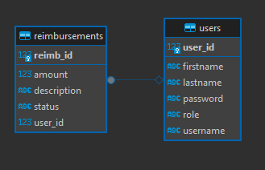

# Employee Reimbursement System (ERS)

## Summary

The purpose of this project is to create a Java Full Stack Employee Reimbursement System for employees to submit reimbursements that can be approved/denied by managers.

## Tech Stack

- React Frontend
    - Typescript
    - Axios
    - NodeJS
- Spring Backend
    - Spring Data JPA
    - Maven
- Cloud-based Postgres Database
- Git/Github
- DBeaver

## Functionality

Functions focuses on employees submitting reimbursements and managers approving or denying them. Users can perform different functions depending on if they are an employee or a manager.

### Employees

- Create an account
- Create a new reimbursment
- View their reimbursements
- View their pending reimbursements
- Update the description of their pending reimbursements

### Managers

- View all reimbursements
- View all pending reimbursements
- Resolve a reimbursement
- View all users
- Delete a user
- Update an employees role to manager

## Security

Users must login to perform any functions other than logging-in or creating an account.

Users can perform ONLY the permitted functins depending on their role.

## Database ERD

## Contributors

- Neil Crum
- Jemal Ebrahim M Sadik